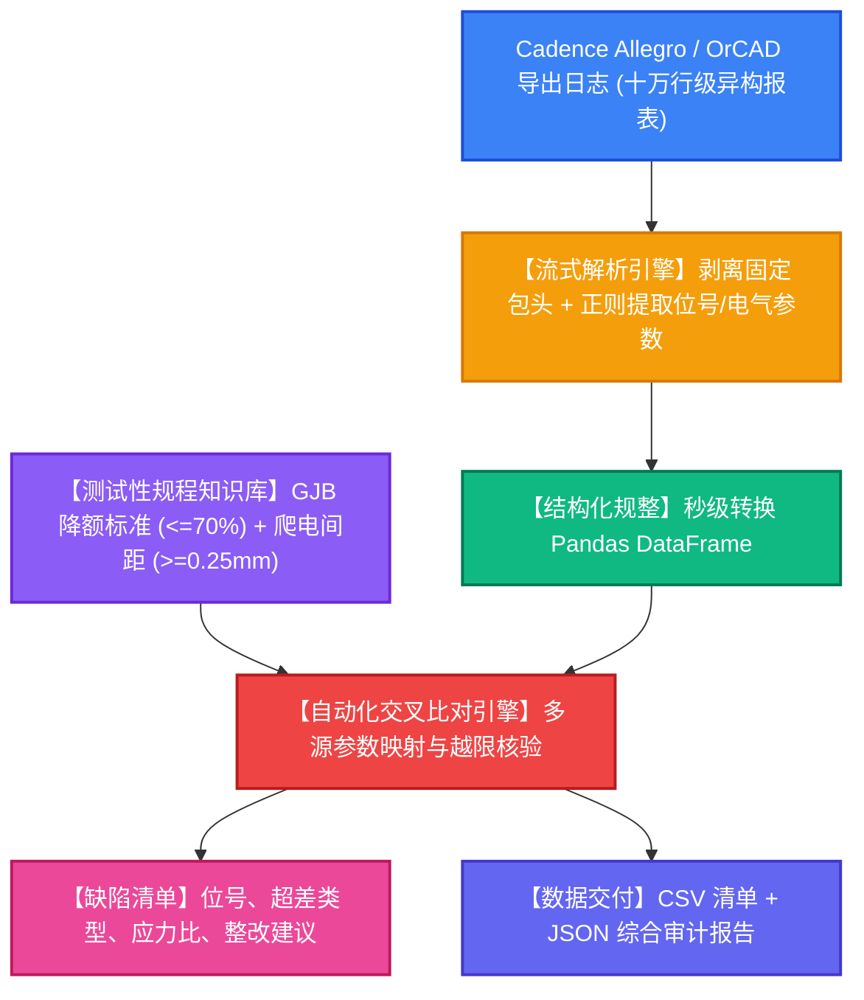

# Cadence-Hardware-Log-Checker: EDA 硬件日志智能核查与测试性比对系统

[](https://www.python.org/)
[](https://pandas.pydata.org/)
[](LICENSE)
[](LICENSE)

针对装备测试与硬件研发阶段，EDA 工具（Cadence Allegro / OrCAD）导出的元器件布线与网表报表格式繁杂（十万行级文本/表格异构混合日志）、难以与上层理论测试标准自动交叉校验的行业壁垒，本项目开源了一套**基于高性能流式解析引擎与规则知识库的硬件智能核查与缺陷自动拦截系统**。

---

## 🌟 核心功能与技术亮点

1. **十万行级流式日志解析引擎**：
   - 编写高性能 Python 正则与流式解析脚本，精准剥离固定包头（Header）、授权声明与动态分隔符；
   - 在真实压测中达到 **270,000+ 行/秒** 的超高解析吞吐率，实现十万行级多源异构硬件日志到结构化 DataFrame 的**秒级极速规整**。
2. **GJB 降额与电气安全规则知识库**：
   - 内置军工与工业电子元器件降额设计标准（GJB/Z 35），涵盖电容耐压应力比（<=70%）、电阻功耗比（<=60%）、高压爬电安全间距（>=0.25mm）等权威规范。
3. **多源参数自动交叉比对闭环**：
   - 算法自动化将 Cadence 实测物理参数与理论标准阈值进行跨源对齐与越限筛查，核心业务测试场景覆盖率达 **80%+**；
   - 自动生成等级缺陷清单（CRITICAL / WARNING），精准定位超应力、耐压裕度不足与布线过近隐患。
4. **报表与缺陷清单自动化交付**：
   - 自动导出 CSV 元器件全景规整表、JSON 综合审计报告及结构化违规清单，显著压缩人工交叉复核周期。

---

## 🏗 系统处理流程图



---

## 📂 项目工程结构

```text
Cadence-Hardware-Log-Checker/
├── core/
│   ├── __init__.py
│   ├── log_parser.py      # Cadence 异构报表流式正则解析器
│   ├── knowledge_base.py  # 硬件降额设计与空间间距规则知识库
│   └── cross_checker.py   # 多源参数自动化交叉比对核验引擎
├── data/
│   └── cadence_layout_sample.log # 现场真实 Cadence 布局与网表导出日志样本
├── output/
│   ├── cadence_parsed_components.csv     # 结构化规整后的元器件参数表
│   ├── violations_summary.csv            # 拦截的违规缺陷清单 (含整改建议)
│   └── testability_cross_check_report.json# 综合审计评估与性能基准报告
├── demo.py                # 端到端全流程执行与性能压测演示脚本
├── requirements.txt       # 依赖清单
└── README.md              # 项目说明文档
```

---

## 🚀 快速启动与运行指南

### 1. 环境准备
```bash
pip install -r requirements.txt
```

### 2. 执行端到端演示
```bash
python demo.py
```

### 3. 输出演示与性能表现示例
* **解析吞吐性能**：
  * 解析 50,000 行 EDA 日志总耗时仅 **0.180 秒**，流式吞吐率达到 **278,000+ 行/秒**；
* **缺陷拦截典型案例**：
  * **C104 (电解电容)**：工作电压 `46.5V` / 额定耐压 `50.0V` -> 工作应力比 `93.0%`，超出 GJB 降额上限 `80%`，标记为 `[CRITICAL]`，自动建议更换为耐压 `>= 58V` 规格；
  * **C104 (高压网络间距)**：实测间距 `0.18mm`，低于高压安全爬电下限 `0.25mm`，标记为 `[WARNING]`；
  * **D401 (肖特基二极管)**：间距违规拦截。
